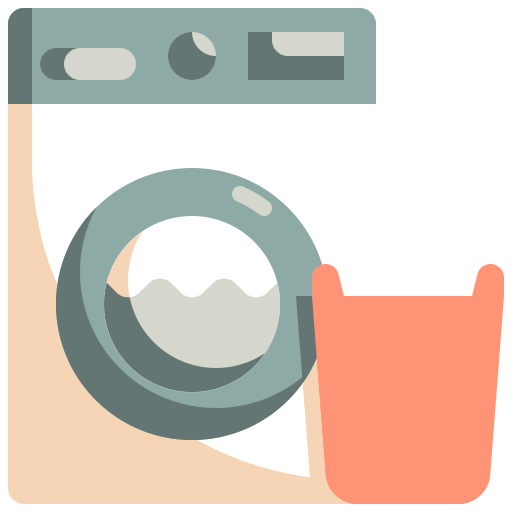

<!-- README template from: https://github.com/othneildrew/Best-README-Template -->
<a name="readme-top"></a>


<!-- PROJECT SHIELDS -->
<!--
*** I'm using markdown "reference style" links for readability.
*** Reference links are enclosed in brackets [ ] instead of parentheses ( ).
*** See the bottom of this document for the declaration of the reference variables
*** for contributors-url, forks-url, etc. This is an optional, concise syntax you may use.
*** https://www.markdownguide.org/basic-syntax/#reference-style-links
-->
[![Contributors][contributors-shield]][contributors-url]
[![Forks][forks-shield]][forks-url]
[![Stargazers][stars-shield]][stars-url]
[![Issues][issues-shield]][issues-url]
[![MIT License][license-shield]][license-url]

<!-- PROJECT LOGO -->
<br />
<div align="center">
  <a href="https://github.com/HE-Arc/calm">
    
  </a>

<h3 align="center">CALM</h3>

  <p align="justify">
    <strong>C</strong>apable and <strong>A</strong>ccessible <strong>L</strong>aundry <strong>M</strong>anager (CALM) is a web application for the management of laundry facilities in rental buildings. It offers features such as monetary management, hourly planning, and reservation management.
    <br>
    <a href="https://github.com/HE-Arc/calm/wiki"><strong>Explore the docs »</strong></a>
    <br>
    <br>
    <a href="https://calm.k8s.ing.he-arc.ch/">View Demo</a>
    <br>
    <a href="https://www.flaticon.com/free-icons/washing-machine" title="washing machine icons">Washing machine icons created by Konkapp - Flaticon</a>
  </p>
</div>

<!-- TABLE OF CONTENTS -->
<details>
  <summary>Table of Contents</summary>
  <ol>
    <li>
      <a href="#about-the-project">About The Project</a>
      <ul>
        <li><a href="#project-mockups">Project Mockups</a></li>
        <li><a href="#built-with">Built With</a></li>
      </ul>
    </li>
    <li>
      <a href="#getting-started">Getting Started</a>
      <ul>
        <li><a href="#prerequisites">Prerequisites</a></li>
        <li><a href="#installation">Installation</a></li>
        <li><a href="#launch-the-project">Launch the project</a></li>
      </ul>
    </li>
    <li><a href="#usage">Usage</a></li>
    <li><a href="#roadmap">Roadmap</a></li>
    <li><a href="#contributing">Contributing</a></li>
    <li><a href="#license">License</a></li>
    <li><a href="#contact">Contact</a></li>
    <li><a href="#acknowledgments">Acknowledgments</a></li>
  </ol>
</details>

<!-- ABOUT THE PROJECT -->
## About The Project
### Project Mockups
[Created on Figma](https://www.figma.com/file/NNrZhlrTNmXNe8WoY6ZDa6/CALM?type=design&node-id=0%3A1&mode=design&t=xZoSIwSpu75IFXqZ-1)

<p align="right">(<a href="#readme-top">back to top</a>)</p>

### Built With
* [![Laravel][Laravel.com]][Laravel-url]
* [![Tailwind CSS][Tailwind.com]][Tailwind-url]
* [![Flowbite][Flowbite.com]][Flowbite-url]

<p align="right">(<a href="#readme-top">back to top</a>)</p>

<!-- GETTING STARTED -->
## Getting Started
To get a local copy up and running follow these simple example steps.

### Prerequisites
If you want to use Docker, install Docker.
If you are not using Docker, download a software like Xampp, Wampp, ...

### Installation
#### Clone the repository
> En SSH
   ```sh
   git clone git@github.com:HE-Arc/calm.git
   ```
> En HTTP
   ```sh
   git clone https://github.com/HE-Arc/calm.git
   ```

If you are working with Docker, skip to the <a href="#docker">Docker</a> section  

#### Docker
In a terminal in the project's current folder
   ```sh
   docker compose up -d
   ```

Once the images have been built, the containers will launch automatically. The application is available at http://localhost:8000.

#### Sans docker
> **⚠️Attention**
>
> It is necessary to run the command `npm install` the first time you get the project to install all dependencies.
> Also, you need to run this command when new packages are added.

##### Setting up the database
If you are working on a local machine with Xampp, for example, start the `apache` and `mysql` services.

To enter the following commands, you need to be in the `~/calm/calm-server/` directory.

Install dependencies and set up the Laravel project.
```sh
composer install
```

```sh
php artisan key:generate
```

```sh
php artisan migrate
```

```sh
php artisan db:seed
```

### Launch the project
> ℹ️ **Important**
>
> **It is necessary to start the Laravel server and the Vite server during development.**

From the subfolder `~\calm\calm-webserver\`, in a terminal, enter the following commands:
   ```sh
   php artisan serve
   ```

   ```sh
   npm run dev
   ```

The application is available at http://localhost:8000.

<p align="right">(<a href="#readme-top">back to top</a>)</p>

<!-- USAGE EXAMPLES -->
## Usage

To test the functionality of the application, you can log in as a test user from the login form with the following credentials:

**Username**
```bash
test@example.com
```

**Password**
```bash
password
```

<p align="right">(<a href="#readme-top">back to top</a>)</p>

<!-- ROADMAP -->
## Roadmap
See the [RoadMap](https://github.com/HE-Arc/calm/wiki/Roadmap)

See the [open issues](https://github.com/HE-Arc/calm/issues) for a full list of proposed features (and known issues).

<p align="right">(<a href="#readme-top">back to top</a>)</p>

<!-- CONTRIBUTING -->
## Contributing

Contributions are what make the open source community such an amazing place to learn, inspire, and create. Any contributions you make are **greatly appreciated**.

If you have a suggestion that would make this better, please fork the repo and create a pull request. You can also simply open an issue with the tag "enhancement".
Don't forget to give the project a star! Thanks again!

1. Fork the Project
2. Create your Feature Branch (`git checkout -b feature/AmazingFeature`)
3. Commit your Changes (`git commit -m 'Add some AmazingFeature'`)
4. Push to the Branch (`git push origin feature/AmazingFeature`)
5. Open a Pull Request

<p align="right">(<a href="#readme-top">back to top</a>)</p>

<!-- LICENSE -->
## License

Distributed under the MIT License. See `LICENSE` for more information.

<p align="right">(<a href="#readme-top">back to top</a>)</p>

<!-- CONTACT -->
## Contact

* Nima Dekhli - [github@ylked](https://github.com/ylked) - [nima@dekhli.ch](mailto:nima@dekhli.ch?subject=[GitHub]%20CALM)
* Lucas Gosteli - [github@lugopi](https://github.com/lugopi) - [lucas.gosteli@he-arc.ch](mailto:lucas.gosteli@he-arc.ch?subject=[GitHub]%20CALM)
* Miranda Fleury - [github@ClawdeenFleury](https://github.com/ClawdeenFleury) - [miranda.fleury@he-arc.ch](mailto:miranda.fleury@he-arc.ch?subject=[GitHub]%20CALM)

<p align="right">(<a href="#readme-top">back to top</a>)</p>

<!-- ACKNOWLEDGMENTS -->
## Acknowledgments

* [Choose an Open Source License](https://choosealicense.com)
* [Flowbite.com][Flowbite-url]
* [Google Fonts and icons](https://fonts.google.com)

<p align="right">(<a href="#readme-top">back to top</a>)</p>

<!-- MARKDOWN LINKS & IMAGES -->
<!-- https://www.markdownguide.org/basic-syntax/#reference-style-links -->
[contributors-shield]: https://img.shields.io/github/contributors/HE-Arc/calm.svg?style=for-the-badge
[contributors-url]: https://github.com/HE-Arc/calm/graphs/contributors
[forks-shield]: https://img.shields.io/github/forks/HE-Arc/calm.svg?style=for-the-badge
[forks-url]: https://github.com/HE-Arc/calm/forks
[stars-shield]: https://img.shields.io/github/stars/HE-Arc/calm.svg?style=for-the-badge
[stars-url]: https://github.com/HE-Arc/calm/stargazers
[issues-shield]: https://img.shields.io/github/issues/HE-Arc/calm.svg?style=for-the-badge
[issues-url]: https://github.com/HE-Arc/calm/issues
[license-shield]: https://img.shields.io/badge/license-MIT-green?style=for-the-badge
[license-url]: https://github.com/HE-Arc/calm/blob/main/LICENSE
[Laravel.com]: https://img.shields.io/badge/Laravel-FF2D20?style=for-the-badge&logo=laravel&logoColor=white
[Laravel-url]: https://laravel.com
[Tailwind.com]: https://img.shields.io/badge/Tailwind%20CSS-2.x-38B2AC?style=flat-square&logo=tailwind-css&logoColor=white
[Tailwind-url]: https://tailwindcss.com/
[Flowbite.com]: https://img.shields.io/badge/Flowbite-3B82F6?style=for-the-badge&logo=flowbite-css&logoColor=white
[Flowbite-url]: https://flowbite.com
